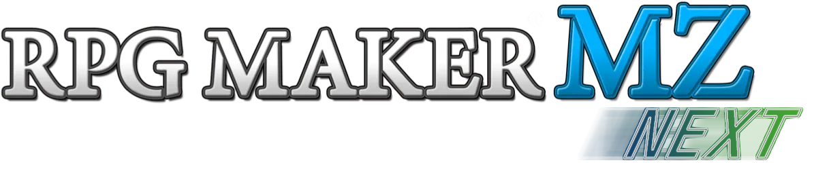

  

## The Modern RPG Maker MZ Framework

> ⚠️ **Work in Progress** — This project is actively in development and is **not yet ready for production use**. APIs are subject to change, features may be incomplete, and breaking changes can occur at any time. Contributions and feedback are welcome, but use in live projects is discouraged until a stable release is announced.

---

## What is this?

**RPG Maker MZ Next** is a modernisation of the **RPG Maker MZ runtime**, rebuilding it on top of **PixiJS v8** and **TypeScript** to bring it in line with contemporary web development standards.

The rewrite focuses exclusively on the **runtime engine** — the editor remains untouched. Projects created in RPG Maker MZ are the target, but the underlying execution layer is replaced with:

- **PixiJS v8 rendering** — leveraging its WebGL/WebGPU pipeline, scene graph, and performance improvements over the legacy renderer.
- **Full TypeScript rewrite** — strict types throughout, enabling better IDE support, safer refactoring, and clearer contracts between systems.
- **Native ESM support** — both the runtime and plugin ecosystem are built around ES Modules, enabling proper dependency management, tree-shaking, and a modern authoring experience for plugin developers.
- **Developer-focused tooling classes** — a suite of utility and helper classes designed to make plugin development, scene management, and engine extension more ergonomic.

## ⚠️ Plugin Compatibility

Because RPG Maker MZ Next is a **full rewrite** of the runtime, the vast majority of existing MZ plugins will **not be compatible out of the box**. This is an expected and unavoidable consequence of two major shifts:

- The rendering layer has moved from PixiJS v5 to **PixiJS v8**, which introduced significant breaking API changes.
- The codebase is now **TypeScript and ESM-based**, departing from the original global-script architecture that most plugins relied on.

This does not mean your favourite plugins are gone forever. The plan is to ease this transition as much as possible by providing clear migration guides, a well-documented plugin API, and compatibility utilities where feasible. Plugin developers will have proper tooling to port and modernise their work.

If you are a plugin developer interested in getting ahead of the curve, contributions and early feedback on the plugin API are very much welcome.
